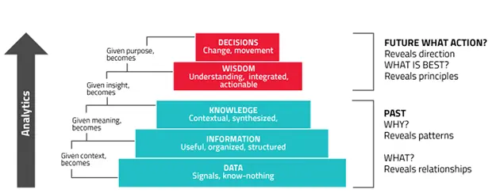

# Health Informatics - WTF?!->FTW!!
---
## Agenda

1. Lecture on Digital Health
2. Intro to the course (Github, Literature, Showcase)
3. Hands-on with Python

---
## Health vs. Healthcare

- Saving someone from not feeling well.
- Preventing someone fall sick: Longevity, 4P Medicine

-> Financing: How to finance something that never happened? Preventions means Out-of-Pocket?

---
## Informatics vs. Data Science (and AI)

- Storage and Data Retrieval
- Generating new processes and forms of organizing

-> Context: How to get doctors understand digital and Digitals understand medicine?

---
## Medical Informatics vs. Health Informatics

---
- Medical Data: Everything that is recorded by a HCP (Origin: Hospital, Practice) -> XX Weeks
- Health Data: Every Biomarker (Origin: Home, Work, Gym, Car,...) -> XX Milliseconds

---

-> Quality: HCP means trust and context. How to create context in Iot and quality data for AI?

---

---
## Data, Information and Knowledge

- Data
- Information
- Knowledge

-> Action: Only when data is turned into actionable insights it is relevant

https://www.i-scoop.eu/big-data-action-value-context/dikw-model/

---
## Interoperability and Data Quality

- How can we generate better understanding about the context of data acquisition entailing a relevant biomarker?
- Metadata to Measurements

-> Trust: Only when we get into a self-enforcing cycle to learning about health in a global distributed and real-time setting we can shape the future of healthcare

